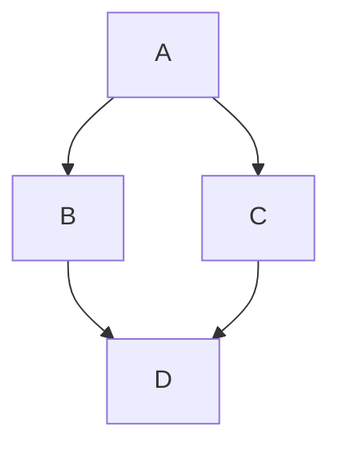

<div align="center" style="margin: -10px 0; margin-top: -45px">
  
</div>


<p align="center">
  <a href="#">
      
   </a>
</p>

Add a concise description of your project.

## Table of Contents

- [Table of Contents](#table-of-contents)
- [📓 Markdown Features Examples](#-markdown-features-examples)
  - [🗂️ Text Boxes](#️-text-boxes)
  - [🔽 Expandable text](#-expandable-text)
  - [📋 List](#-list)
  - [🖱️ Hover text](#️-hover-text)
  - [📊 Table](#-table)
  - [📈 Flow Chart](#-flow-chart)
  - [🗺️ Map Example](#️-map-example)
- [⚙️ Installation Instructions](#️-installation-instructions)
  - [📌 Prerequisites](#-prerequisites)
  - [🪜 Steps](#-steps)
- [🚀 Usage](#-usage)
  - [▶️ Example Command](#️-example-command)
  - [📤 Expected Output](#-expected-output)
- [🤝 Contributing](#-contributing)
- [📜 License](#-license)
- [🤝 Collaborators](#-collaborators)
- [📖 References](#-references)


## 📓 Markdown Features Examples

### 🗂️ Text Boxes

> This is a simple text box.

> [!NOTE]
> Useful information that users should know, even when skimming content.

> [!TIP]
> Helpful advice for doing things better or more easily.

> [!IMPORTANT]
> Key information users need to know to achieve their goal.

> [!WARNING]
> Urgent info that needs immediate user attention to avoid problems.

> [!CAUTION]
> Advises about risks or negative outcomes of certain actions.


### 🔽 Expandable text

<details>
<summary>Click to expand</summary>

This is the hidden content that shows when you expand the dropdown.

- Item 1
- Item 2
- Item 3

</details>

### 📋 List

- ✅ Feature 1
- ✅ Feature 2
- ✅ Feature 3

### 🖱️ Hover text

This is a [hover text](## "your hover text") example.

### 📊 Table


| Feature          | Project A            | Project B            | Project C            |
|------------------|----------------------|----------------------|----------------------|
| Ease of Use      | ⭐⭐⭐⭐⭐               | ⭐⭐⭐⭐                | ⭐⭐⭐                 |
| Performance      | ⭐⭐⭐⭐                | ⭐⭐⭐⭐⭐               | ⭐⭐⭐⭐⭐               |
| Community Support| ⭐⭐⭐⭐⭐               | ⭐⭐⭐                 | ⭐⭐⭐⭐                |
| Documentation    | ⭐⭐⭐⭐⭐               | ⭐⭐⭐⭐                | ⭐⭐                  |


### 📈 Flow Chart



### 🗺️ Map Example

```geojson
{
  "type": "FeatureCollection",
  "features": [
    {
      "type": "Feature",
      "id": 1,
      "properties": {
        "ID": 0
      },
      "geometry": {
        "type": "Polygon",
        "coordinates": [
          [
            [
              -90,
              35
            ],
            [
              -90,
              30
            ],
            [
              -85,
              30
            ],
            [
              -85,
              35
            ],
            [
              -90,
              35
            ]
          ]
        ]
      }
    }
  ]
}
```

## ⚙️ Installation Instructions

To set up the development environment, follow these steps:

### 📌 Prerequisites

- Python 3.8 or later
- Git

### 🪜 Steps

1. **Clone the repository:**

   ```bash
   git clone https://github.com/yourusername/your-repo.git
   cd your-repo
   ```

2. **Create a virtual environment:**

   ```bash
   python3 -m venv .venv
   source .venv/bin/activate  # On Windows use `.venv\Scriptsctivate`
   ```

3. **Install the requirements:**

   ```bash
   pip install -r requirements.txt
   ```

4. **Run the application:**

   ```bash
   python main.py
   ```

## 🚀 Usage

### ▶️ Example Command

```bash
python main.py --help
```

### 📤 Expected Output

```text
Usage: main.py [OPTIONS]
Options:
  --help  Show this message and exit.
```


## 🤝 Contributing

Contributions are what make the open-source community amazing. To contribute:

1. Fork the project.
2. Create a feature branch (`git checkout -b feature/new-feature`).
3. Commit your changes (`git commit -m 'Add some feature'`).
4. Push to the branch (`git push origin feature/new-feature`).
5. Open a Pull Request.


## 📜 License

This project is licensed under the **[General Public License](LICENSE)**.


## 🤝 Collaborators

We thank the following people who contributed to this project:

<table>
  <tr>
    <td align="center">
      <a href="https://github.com/MatheusFS-dev" title="Matheus Ferreira">
        <br>
        <sub>
          <b>Matheus Ferreira</b>
        </sub>
      </a>
    </td>
  </tr>
</table>

## 📖 References

- [Markdown Cheatsheet](https://www.markdownguide.org/cheat-sheet/)
- [Example File Link](assets/minecraft/lang/$_langs.bat)
