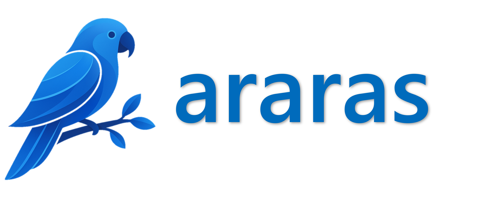

<div align="center">
  
</div>


<p align="center">
<a href="https://github.com/DenverCoder1/readme-typing-svg"></a>
</p>

<p align="center">
  <a href="https://github.com/MatheusFS-dev/araras/blob/main/LICENSE.txt">
    
  </a>
  <a href="https://github.com/MatheusFS-dev/araras/stargazers"></a>
  <a href="https://github.com/MatheusFS-dev/araras/network/members"></a>
  <a href="https://visitor-badge.laobi.icu/badge?page_id=MatheusFS-dev.araras"></a>
</p>

<p align="center">
  <a href="#">
      
   </a>
</p>

This is a python module that provides a set of tools for working with machine learning models. It includes utilities for neural architecture search using optuna, builders and helpers for keras/tensorflow, a monitoring system for the kernel, and several other features. The module is designed to be easy to use and flexible, allowing users to customize their machine learning workflows.

## Table of Contents

- [Table of Contents](#table-of-contents)
- [📚 API Documentation](#-api-documentation)
- [⚙️ Installation Instructions](#️-installation-instructions)
- [🚀 Release Flow](#-release-flow)
- [🔖 Versioning Policy](#-versioning-policy)
- [🤝 Contributing](#-contributing)
- [📜 License](#-license)
- [🤝 Collaborators](#-collaborators)

## 📚 API Documentation

For comprehensive documentation, examples, and detailed usage guides, please visit our **[Documentation Wiki](docs/wiki.md)**.

## ⚙️ Installation Instructions

Install only the feature set you need:

```bash
pip install araras
pip install araras[tensorflow]
pip install araras[torch]
pip install araras[viz]
pip install araras[notebook]
pip install araras[gnn]
pip install araras[all]
```

Notes:

- The base install is lightweight and excludes heavyweight ML backends.
- TensorFlow support is enabled via the tensorflow extra.
- PyTorch support is enabled via the torch extra.
- Visualization and notebook extras are optional and independent.

## 🚀 Release Flow

Maintainer quick path:

```bash
python -m build
twine check dist/*
git tag v1.0.0
git push origin v1.0.0
```

Tag pushes matching v* trigger the publish workflow.

## 🔖 Versioning Policy

- The value in pyproject.toml project.version must match the Git tag version.
- Release order: bump version, merge to main, tag as v<same-version>, push tag.
- PyPI versions are immutable and cannot be re-used.

## 🤝 Contributing

Contributions are what make the open-source community amazing. To contribute:

1. Fork the project.
2. Create a feature branch (`git checkout -b feature/new-feature`).
3. Commit your changes (`git commit -m 'Add some feature'`).
4. Push to the branch (`git push origin feature/new-feature`).
5. Open a Pull Request.

## 📜 License

This project is licensed under the **[General Public License](LICENSE)**.

## 🤝 Collaborators

We thank the following people who contributed to this project:

<table>
  <tr>
    <td align="center">
      <a href="https://github.com/MatheusFS-dev" title="Matheus Ferreira">
        <br>
        <sub>
          <b>Matheus Ferreira</b>
        </sub>
      </a>
    </td>
  </tr>
</table>

